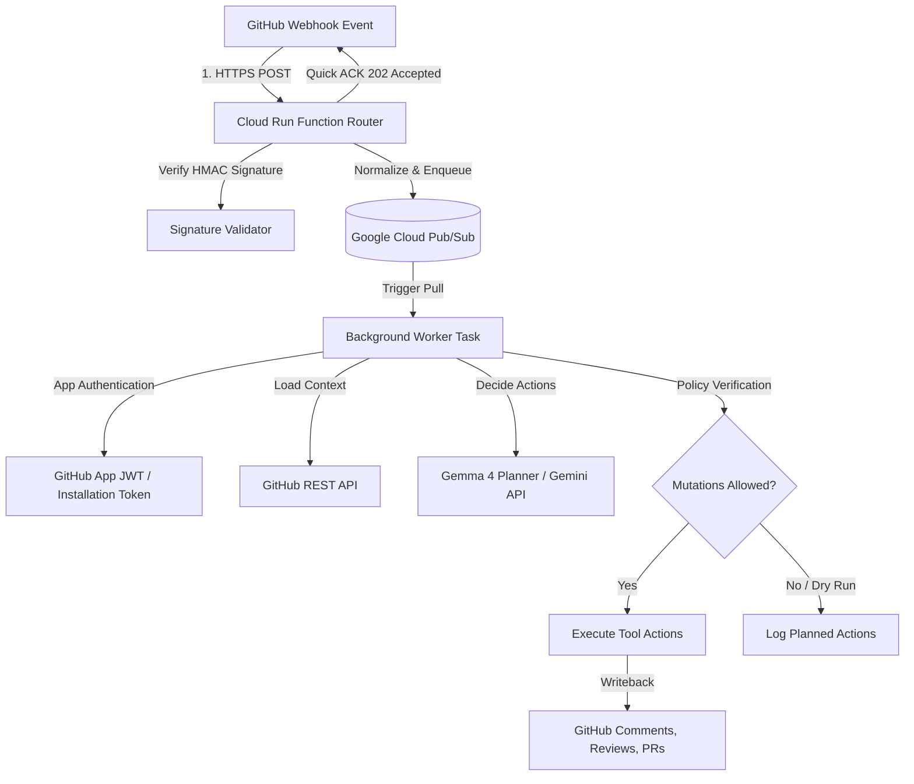

# 🤖 Hannibal Hub Agents: Distributed GitHub App Webhook Orchestrator

A unified, event-driven service that handles GitHub webhooks via a serverless router, queues event processing asynchronously using **Google Cloud Pub/Sub**, and runs an agentic loop powered by **Gemma 4** & **Google ADK** to safely interact with GitHub repositories.

---

## 🏗️ System Architecture

The orchestrator is designed for high reliability, security, and zero-trust event execution using a decoupled, distributed architecture:



---

## 📁 Repository Structure

```
├── .agents/skills/          # Localized agent operational skills
│   ├── gcloud-logging/      # GCP logging inspection protocol & project matrix
│   ├── github-bot-identity/ # Bot identity authentication & credentials switch
│   └── github-pr-manager/   # End-to-end GitHub PR lifecycle management
├── .github/workflows/
│   └── deploy.yml           # Automated CI/CD deployment to VM via IAP SSH
├── scripts/
│   ├── load_secrets.sh      # Load environment variables dynamically from GCP Secret Manager
│   ├── migrate_pubsub_messages.py # Pub/Sub backlog migration helper
│   ├── setup_vm_user_service.sh   # VM user-space systemd service setup script
│   ├── hannibal-webhook-agent.service # User-space systemd unit file template
│   ├── publish_test_message.py    # Test webhook payload publisher
│   └── ruff-all.sh          # Clinical linting & formatting validation script
├── src/
│   └── webhook_agent/       # Core package
│       ├── worker.py        # Pub/Sub subscriber entry point and main polling loop
│       ├── processor.py     # Canonical event routing, deduplication, & AgentCore delegation
│       ├── agent_core.py    # ADK agent wrapper & execution entry point
│       ├── webhook_agent.py # ADK-powered WebhookAgent with tool execution & writeback policy
│       ├── bot_identity.py  # Multi-signal bot identity detection for loop avoidance
│       ├── memory_service.py # ADK agent memory and session persistence service
│       ├── gemma_planner.py # Gemma 4 model interaction interface
│       ├── github_credential_helper.py # GitHub App JWT generation & cached installation tokens
│       ├── enqueue.py       # Pub/Sub payload publishing helpers
│       ├── types.py         # Common dataclasses and ActionResult definitions
│       ├── templates/       # Local prompt & code review templates
│       └── tests/           # Pytest test suite & fixtures
├── main.py                  # Distributed process manager entry point
├── pyproject.toml           # Dependency specification (uv-compatible)
├── README.md                # Repository documentation
└── cloud_run_function.md    # Serverless webhook router implementation guide
```

---

## 🚀 Getting Started

### 1. Installation
This project uses `uv` for lightning-fast dependency management:

```bash
# Sync dependencies and set up the virtual environment
uv sync
```

### 2. Configuration & Secret Management
Ensure the required environment variables are configured. You can load secrets directly from **GCP Secret Manager** into memory without keeping plain-text secrets or key files on disk:

```bash
# Load secrets directly from GCP Secret Manager into memory
source scripts/load_secrets.sh
```

#### Infrastructure Config:
- `PUBSUB_PROJECT`: Dedicated Google Cloud Project ID (e.g. `cgj8702-webhook-agent`).
- `PUBSUB_TOPIC`: Full topic path (`projects/.../topics/webhooks`).
- `PUBSUB_SUBSCRIPTION`: Full subscription path (`projects/.../subscriptions/webhooks-sub`).
- `PUBSUB_DEAD_LETTER_TOPIC`: Dead-letter topic path for failed payloads.
- `GOOGLE_APPLICATION_CREDENTIALS`: Path to Service Account JSON key for Pub/Sub & Cloud Logging.

#### Agent & GitHub App Config:
- `GITHUB_APP_ID`: Numeric App ID of your GitHub App.
- `GITHUB_INSTALLATION_ID`: Target installation ID for token exchange.
- `GITHUB_PRIVATE_KEY_PATH`: Path to the private key PEM file for your GitHub App (`/tmp/keys/github-app-private-key.pem`).
- `GEMINI_API_KEY` / `GOOGLE_API_KEY`: Gemini API credentials.
- `GEMMA_MODEL`: Primary model for planning calls (defaults to `gemma-4-31b-it`).
- `GEMMA_MODEL_FALLBACK`: Fallback model on transient errors (defaults to `gemma-4-26b-a4b-it`).
- `GEMMA_MODEL_MAX_RETRIES`: Maximum retry attempts on transient errors (defaults to `5`).
- `ALLOW_AUTOMATED_MUTATIONS`: Set to `1` or `true` to allow active writebacks to GitHub repos.

---

## 🛠️ Operations & Deployment

### Running the Background Worker
Start the worker process locally:

```bash
uv run python main.py
```

### VM Deployment & User-Space Systemd Service
On the target VM (`hannibal-hub-free`), the agent runs as a user-space systemd service (`hannibal-webhook-agent.service`):

```bash
# Initialize and start the user-space systemd service
bash scripts/setup_vm_user_service.sh

# Monitor service status on VM
systemctl --user status hannibal-webhook-agent.service

# Restart service on VM
systemctl --user restart hannibal-webhook-agent.service

# Follow live service logs
journalctl --user -u hannibal-webhook-agent.service -f
```

All pushes to `main` automatically trigger [`.github/workflows/deploy.yml`](file:///.github/workflows/deploy.yml) to deploy code updates and restart `hannibal-webhook-agent.service` via IAP SSH!

### Migrating Backlogged Pub/Sub Messages
To migrate backlogged messages between Pub/Sub projects or subscriptions:

```bash
uv run python scripts/migrate_pubsub_messages.py \
    --source-subscription projects/OLD_PROJECT/subscriptions/webhook-sub \
    --target-topic projects/NEW_PROJECT/topics/webhooks
```

---

## 🔒 Security & Policy Gates

1. **Edge Signature Verification**: All incoming webhooks are validated at the Cloud Run router using `WEBHOOK_SECRET` HMAC signatures. Unauthenticated payloads are rejected before reaching Pub/Sub.
2. **Short-lived Token Rotation**: `github_credential_helper.py` handles automatic caching and rotation of installation access tokens (valid for max 1 hour).
3. **Loop Avoidance**: `bot_identity.py` evaluates multi-signal bot identity checks (`sender.login`, `comment.user`, `performed_via_github_app`) to suppress self-referential bot actions.
4. **Purity Gates & Writeback Policy**: `WebhookAgent` checks `ALLOW_AUTOMATED_MUTATIONS`. If not enabled, all mutations fall back to log-only operations, preventing unauthorized automated commits or comments.
5. **Agentic Guardrails**:
   - **Least Privilege Tooling**: The planner exposes only the minimum necessary tool schemas required for the event context.
   - **Context-Aware Prompting**: Prompts are enriched with PR diffs, issue comments, and repo context.