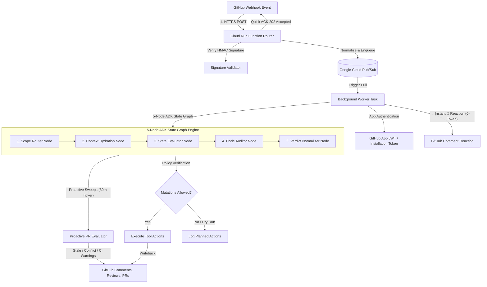

# 🤖 Hannibal Hub Agents: Distributed GitHub App Webhook Orchestrator

A unified, event-driven service that handles GitHub webhooks via a serverless router, queues event processing asynchronously using **Google Cloud Pub/Sub**, and runs an agentic workflow powered by **Gemma 4**, **Google GenAI**, & **Google ADK** to safely orchestrate GitHub repository reviews, conflict resolutions, and proactive code health sweeps.

---

## 🏗️ System Architecture

The orchestrator is designed for high reliability, security, and zero-trust event execution using a decoupled, distributed architecture with a **5-Node ADK State Graph Workflow Engine** and **Proactive PR Evaluator**:



---

## 📁 Repository Structure

```
├── .agents/skills/          # Localized agent operational skills
│   ├── gcloud-logging/      # GCP logging inspection protocol & project matrix
│   ├── github-bot-identity/ # Bot identity authentication & credentials switch
│   └── github-pr-manager/   # End-to-end GitHub PR lifecycle management
├── .github/workflows/
│   └── deploy.yml           # Automated CI/CD deployment to VM via IAP SSH
├── scripts/
│   ├── load_secrets.sh      # Load environment variables dynamically from GCP Secret Manager
│   ├── migrate_pubsub_messages.py # Pub/Sub backlog migration helper
│   ├── setup_vm_user_service.sh   # VM user-space systemd service setup script
│   ├── hannibal-webhook-agent.service # User-space systemd unit file template
│   ├── publish_test_message.py    # Test webhook payload publisher
│   └── ruff-all.sh          # Clinical linting & formatting validation script
├── src/
│   ├── token_optimized_agent/ # Zero-Cost ADK Token Optimization Module
│   │   ├── agent.py         # Task Mode sub-agents & stateless helper agent definitions
│   │   ├── app.py           # App with EventsCompactionConfig & ContextCacheConfig
│   │   ├── callbacks.py     # Tool response payload truncation & MessagePruningPlugin
│   │   └── tools.py         # Off-context artifact storage & lookup tools
│   └── webhook_agent/       # Core Webhook Orchestrator Package
│       ├── worker.py        # Pub/Sub subscriber entry point and main polling loop
│       ├── processor.py     # Event routing, deduplication, 👀 reaction, & AgentCore delegation
│       ├── agent_core.py    # ADK agent wrapper & execution entry point
│       ├── webhook_agent.py # ADK-powered WebhookAgent with tool execution & writeback policy
│       ├── state_graph.py   # 5-Node ADK State Graph Workflow Engine
│       ├── proactive_service.py # Proactive PR evaluator for stale threads, conflicts, & CI runs
│       ├── schemas.py       # Pydantic response models & universal markdown string field validators
│       ├── formatter.py     # GitHub Flavored Markdown renderer for code reviews & sync reviews
│       ├── bot_identity.py  # Multi-signal bot identity detection for loop avoidance
│       ├── memory_service.py # ADK agent memory and session persistence service
│       ├── gemma_planner.py # Gemma 4 model interaction interface
│       ├── github_credential_helper.py # GitHub App JWT generation & cached installation tokens
│       ├── enqueue.py       # Pub/Sub payload publishing helpers
│       ├── types.py         # Common dataclasses and ActionResult definitions
│       ├── tools/           # Isolated Git Worktree tools (/fix & /resolve execution)
│       │   ├── auto_fix.py          # Isolated Git Worktree auto-fix tool
│       │   └── resolve_conflicts.py # Ephemeral Git Worktree merge conflict resolution tool
│       ├── templates/       # Local prompt & code review templates
│       └── tests/           # Pytest test suite & fixtures
├── tests/
│   └── unit/                # Unit tests for token optimization, callbacks, & logic
├── main.py                  # Distributed process manager entry point
├── pyproject.toml           # Dependency & pytest specification (uv-compatible)
├── README.md                # Repository documentation
└── cloud_run_function.md    # Serverless webhook router implementation guide
```

---

## ⚡ High-Efficiency Token Optimization & Advanced Features

The project includes built-in strategies to maximize context efficiency, eliminate unnecessary LLM calls, and execute 1-turn webhook responses:

1. **5-Node ADK State Graph Workflow Engine**:
   - `ScopeRouterNode`: Classifies event scope (`core_backend`, `infra`, `docs`).
   - `ContextHydrationNode`: Prefetches commit diffs, commit history, and review threads.
   - `StateEvaluatorNode`: Evaluates proactive rules (merge conflicts, stale feedback, failing CI runs).
   - `CodeAuditorNode`: Ingests LLM audit payload.
   - `VerdictNormalizerNode`: Calculates strict verdict safety and outputs normalized `CodeReviewResponse`.
2. **Proactive PR Evaluator (`ProactiveEvaluator`)**:
   - Runs a 30-minute background ticker in the worker process.
   - Scans open PRs for:
     - **Stale Review Threads**: Unresolved review feedback idle >24h ➔ Posts soft reminder comment.
     - **Merge Conflicts**: Target branch conflicts (`mergeable_state == "dirty"`) ➔ Posts conflict warning comment.
     - **Failing CI Runs**: Failed status check runs ➔ Posts targeted diagnostic recommendations.
3. **Universal Pydantic Field Validators (`clean_field_string`)**:
   - Strips leading Markdown bullets, emoji badges, or key label prefixes (`Update Summary:**`, `**Executive Summary:**`) across all Pydantic schemas (`CodeReviewResponse`, `SyncReviewResponse`, `IssueItem`, `RiskItem`, `SyncResolutionItem`) to eliminate redundant label echo in generated markdown.
4. **Programmatic `/resolve` Git Worktree Conflict Resolution**:
   - Triggered programmatically when a user comments `/resolve`.
   - Clones the PR into an isolated Git Worktree (`/tmp/worktrees/pr_X_...`), merges `origin/main` cleanly, synthesizes conflict resolution via LLM, verifies `pytest` & `ruff-all.sh`, configures `http.extraheader` bearer token auth, and pushes the updated branch automatically.
5. **Autonomous `/fix` Review-Fix Tool (`auto_fix_pr_review_feedback`)**:
   - Triggered by `/fix`, `/auto`, or `/fix-it` slash commands. Clones the PR in an isolated Git Worktree (`/tmp/worktrees/pr_X_fix/`), applies surgical fixes, verifies `pytest` & `ruff-all.sh`, and pushes the resolved commit automatically.
6. **Tier-Aware Model Chains & 503 Failover**:
   - Dynamically routes requests based on active environment tier (`WEBHOOK_TIER`).
   - Uses `gemini-3.5-flash-lite`, `gemma-4-31b-it`, and `gemma-4-26b-a4b-it`.
   - Features instant `0.5s` failover on `503 UNAVAILABLE` high-demand server spikes while preserving 429 rate limit backoff.
7. **Resolution Tracking & Re-Review Templates**:
   - Tracks **`[RESOLVED]`** vs **`[UNRESOLVED]`** items across commits using structured schema validation.
8. **Programmatic 👀 Reaction**:
   - Immediately adds an `eyes` reaction to user comments upon receiving webhooks in `processor.py` (0 token cost).

---

## 🚀 Getting Started

### 1. Installation
This project uses `uv` for lightning-fast dependency management:

```bash
# Sync dependencies and set up the virtual environment
uv sync
```

### 2. Running Tests
Run the full test suite (including token optimization, proactive evaluator, state graph, and worker tests):

```bash
uv run pytest
```

---

## 🛠️ Operations & Deployment

### Running the Background Worker
Start the worker process locally:

```bash
uv run python main.py
```

### VM Deployment & User-Space Systemd Service
On the target VM (`hannibal-hub-free`), the agent runs as a user-space systemd service (`hannibal-webhook-agent.service`):

```bash
# Initialize and start the user-space systemd service
bash scripts/setup_vm_user_service.sh

# Monitor service status on VM
systemctl --user status hannibal-webhook-agent.service

# Restart service on VM
systemctl --user restart hannibal-webhook-agent.service

# Follow live service logs
journalctl --user -u hannibal-webhook-agent.service -f
```

All pushes to `main` automatically trigger [`.github/workflows/deploy.yml`](file:///.github/workflows/deploy.yml) to deploy code updates and restart `hannibal-webhook-agent.service` via IAP SSH!