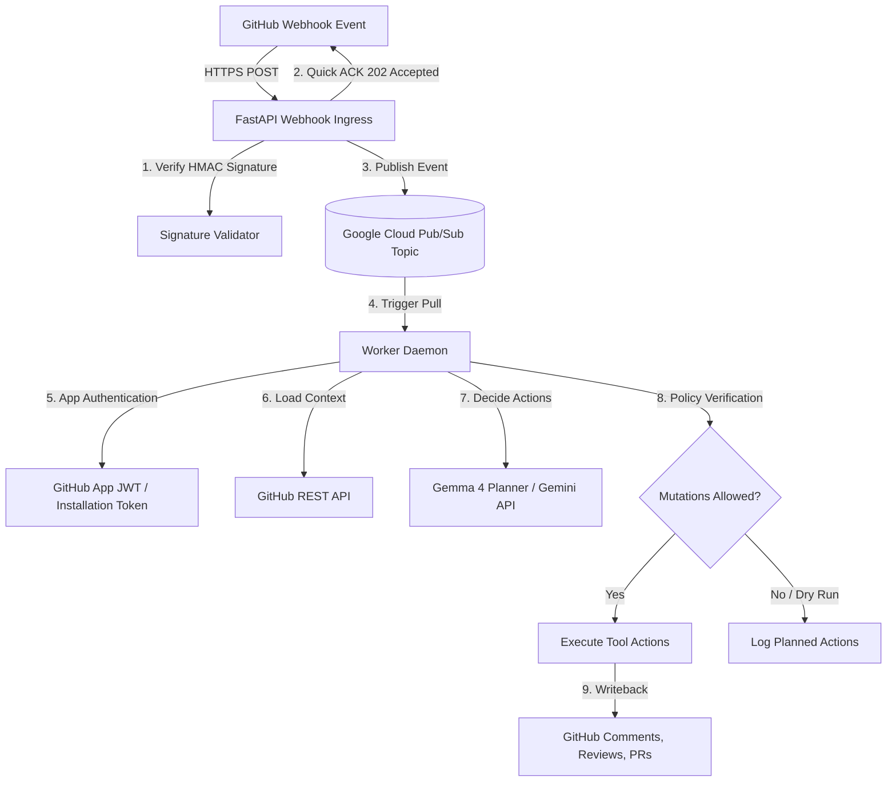

# 🤖 Hannibal Hub Agents: Standalone GitHub App Webhook Orchestrator

A stateless, decoupled, and event-driven worker service that handles GitHub webhooks, verifies signatures, queues event processing asynchronously, and runs an agentic loop powered by **Gemma 4** to safely interact with GitHub repositories.

---

## 🏗️ System Architecture

The webhook orchestrator is designed for high reliability, security, and zero-trust event execution:



---

## 📁 Repository Structure

```
├── .agents/                 # Shared agent scripts & protocols
├── src/
│   └── webhook_agent/       # Core package
│       ├── app.py           # FastAPI Webhook Ingress (receives & verifies)
│       ├── enqueue.py       # Pub/Sub enqueue helper
│       ├── worker.py        # Subscriber daemon consuming the event queue
│       ├── agent_core.py    # Tool schema validation & action execution
│       └── gemma_planner.py # Gemma 4 model interaction via Gemini SDK
├── github_app_credential_helper.py  # Utility for App JWT & cached access tokens
├── pyproject.toml           # Dependency specification (uv-compatible)
├── webhook_agent_TODO.md    # Local roadmap and first-PR tasks
└── github_app_webhook_project_plan.md # Global design document
```

---

## 🚀 Getting Started

### 1. Installation
This project uses `uv` for lightning-fast dependency management:

```bash
# Sync dependencies and set up the virtual environment
uv sync
```

### 2. Configuration
Ensure the following environment variables are set in your environment or `.envrc` file:

#### Ingress Receiver Config:
- `WEBHOOK_SECRET`: The shared secret configured on the GitHub App to verify HMAC signatures.
- `PUBSUB_TOPIC`: The Google Cloud Pub/Sub topic to publish raw webhooks into.

#### Worker & Agent Config:
- `PUBSUB_PROJECT`: Your Google Cloud Project ID (e.g. `chatbot-project-hannibal`).
- `PUBSUB_SUBSCRIPTION`: The Pub/Sub subscription name to pull jobs from.
- `PUBSUB_DEAD_LETTER_TOPIC`: (Optional) Topic to route permanently failing events.
- `GITHUB_APP_ID`: Numeric ID of your GitHub App.
- `GITHUB_INSTALLATION_ID`: Target installation ID for token exchange.
- `GITHUB_PRIVATE_KEY_PATH`: Path to the private key PEM file for your GitHub App.
- `GEMINI_API_KEY`: API key for model planning calls.
- `GEMMA_MODEL`: The Gemma model to use (defaults to `gemma-4-31b-it`).
- `ALLOW_AUTOMATED_MUTATIONS`: Set to `1` or `true` to allow active writebacks to GitHub.
- `DRY_RUN`: Set to `1` to preview actions without executing mutations.

---

## 🛠️ Operations & Execution

### Running the Webhook Receiver Ingress
Start the FastAPI server (typically run with Uvicorn):
```bash
uv run uvicorn src.webhook_agent.app:app --host 0.0.0.0 --port 8000
```

### Running the Worker Daemon
Start the background worker to consume events and execute agent actions:
```bash
uv run python src/webhook_agent/worker.py
```

### Testing Credentials & App Tokens
Use the credential helper CLI directly to fetch or verify installation access tokens:
```bash
uv run python github_app_credential_helper.py \
    --app-id <YOUR_APP_ID> \
    --installation-id <YOUR_INSTALLATION_ID> \
    --private-key <PATH_TO_PEM>
```

---

## 🔒 Security & Policy Gates

1. **HMAC Signature Checks**: All incoming webhooks must match the configured `WEBHOOK_SECRET` signature. Unsigned or mismatching payloads are rejected immediately with `401 Unauthorized`.
2. **Short-lived Tokens**: The helper automatically handles cache expiration and rotation of installation access tokens (valid for maximum 1 hour).
3. **Purity Gates**: The worker checks `ALLOW_AUTOMATED_MUTATIONS`. If not explicitly enabled, all actions fallback to log-only operations, preventing unexpected automated commits, issues, or comments.
