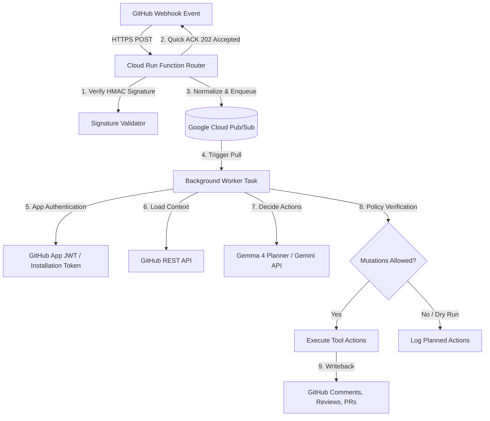

# 🤖 Hannibal Hub Agents: Distributed GitHub App Webhook Orchestrator

A unified, event-driven service that handles GitHub webhooks via a serverless router, queues event processing asynchronously using **Google Cloud Pub/Sub**, and runs an agentic loop powered by **Gemma 4** to safely interact with GitHub repositories.

---

## 🏗️ System Architecture

The orchestrator is designed for high reliability, security, and zero-trust event execution using a decoupled, distributed architecture:



---

## 📁 Repository Structure

```
├── src/
│   └── webhook_agent/       # Core package
│       ├── worker.py        # Pub/Sub subscriber and entry point
│       ├── processor.py     # Event routing & agent orchestration logic
│       ├── agent_core.py    # Tool schema validation & action execution
│       ├── gemma_planner.py # Gemma 4 model interaction via Gemini SDK
│       ├── enqueue.py       # Pub/Sub publishing helpers
│       ├── github_credential_helper.py # App JWT & cached access tokens
│       └── templates/       # Local prompt/review templates
├── main.py                  # Entry point to launch the background worker
├── pyproject.toml           # Dependency specification (uv-compatible)
├── README.md                # Documentation
└── cloud_run_function.md    # Implementation guide for the serverless router
```

---

## 🚀 Getting Started

### 1. Installation
This project uses `uv` for lightning-fast dependency management:

```bash
# Sync dependencies and set up the virtual environment
uv sync
```

### 2. Configuration
Ensure the following environment variables are set:

#### Infrastructure Config:
- `PUBSUB_PROJECT`: Your Google Cloud Project ID.
- `PUBSUB_SUBSCRIPTION`: The full path to the Pub/Sub subscription (e.g., `projects/.../subscriptions/...`).

#### Agent Config:
- `GITHUB_APP_ID`: Numeric ID of your GitHub App.
- `GITHUB_INSTALLATION_ID`: Target installation ID for token exchange.
- `GITHUB_PRIVATE_KEY_PATH`: Path to the private key PEM file for your GitHub App.
- `GEMINI_API_KEY`: API key for model planning calls.
- `GEMMA_MODEL`: The Gemma model to use (defaults to `gemma-4-31b-it`).
- `GEMMA_MODEL_FALLBACK`: Fallback model when primary is unavailable (defaults to `gemma-4-26b-a4b-it`).
- `GEMMA_MODEL_MAX_RETRIES`: Maximum retry attempts on transient errors (defaults to `5`).
- `ALLOW_AUTOMATED_MUTATIONS`: Set to `1` or `true` to allow active writebacks to GitHub.

---

## 🛠️ Operations & Execution

### Running the Background Worker
Start the worker process which subscribes to the Pub/Sub topic and processes queued events:

```bash
uv run python main.py
```

### Testing Credentials & App Tokens
Use the credential helper CLI directly to fetch or verify installation access tokens:
```bash
uv run python src/webhook_agent/github_credential_helper.py \
    --app-id <YOUR_APP_ID> \
    --installation-id <YOUR_INSTALLATION_ID> \
    --private-key <PATH_TO_PEM>
```

---

## 🔒 Security & Policy Gates

1. **Edge Signature Checks**: All incoming webhooks are verified at the router level (Cloud Run Function) using the `WEBHOOK_SECRET` HMAC signature. Mismatching payloads are rejected before ever reaching the queue.
2. **Short-lived Tokens**: The credential helper handles automatic rotation and caching of installation access tokens (valid for max 1 hour).
3. **Purity Gates**: The `AgentCore` checks `ALLOW_AUTOMATED_MUTATIONS`. If not enabled, all actions fallback to log-only operations, preventing unexpected automated commits or comments.
4. **Agentic Guardrails**: To prevent LLM hallucinations and unauthorized mutations:
   - **Least Privilege Tooling**: The planner provides only the minimum necessary tool schemas for the specific event type being processed.
   - **Context-Aware Prompting**: Prompts are enriched with precise metadata and injected PR diffs/templates to ensure the agent targets the correct resources accurately.