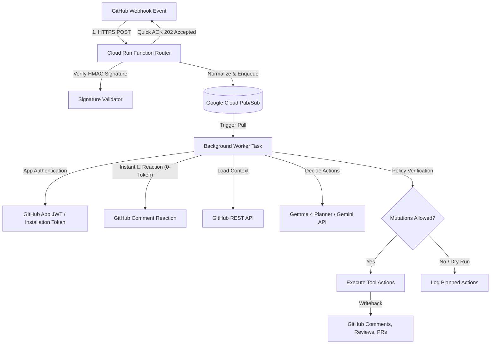

# 🤖 Hannibal Hub Agents: Distributed GitHub App Webhook Orchestrator

A unified, event-driven service that handles GitHub webhooks via a serverless router, queues event processing asynchronously using **Google Cloud Pub/Sub**, and runs an agentic loop powered by **Gemma 4** & **Google ADK** to safely interact with GitHub repositories.

---

## 🏗️ System Architecture

The orchestrator is designed for high reliability, security, and zero-trust event execution using a decoupled, distributed architecture:



---

## 📁 Repository Structure

```
├── .agents/skills/          # Localized agent operational skills
│   ├── gcloud-logging/      # GCP logging inspection protocol & project matrix
│   ├── github-bot-identity/ # Bot identity authentication & credentials switch
│   └── github-pr-manager/   # End-to-end GitHub PR lifecycle management
├── .github/workflows/
│   └── deploy.yml           # Automated CI/CD deployment to VM via IAP SSH
├── scripts/
│   ├── load_secrets.sh      # Load environment variables dynamically from GCP Secret Manager
│   ├── migrate_pubsub_messages.py # Pub/Sub backlog migration helper
│   ├── setup_vm_user_service.sh   # VM user-space systemd service setup script
│   ├── hannibal-webhook-agent.service # User-space systemd unit file template
│   ├── publish_test_message.py    # Test webhook payload publisher
│   └── ruff-all.sh          # Clinical linting & formatting validation script
├── src/
│   ├── token_optimized_agent/ # Zero-Cost ADK Token Optimization Module
│   │   ├── agent.py         # Task Mode sub-agents & stateless helper agent definitions
│   │   ├── app.py           # App with EventsCompactionConfig & ContextCacheConfig
│   │   ├── callbacks.py     # Tool response payload truncation & MessagePruningPlugin
│   │   └── tools.py         # Off-context artifact storage & lookup tools
│   └── webhook_agent/       # Core Webhook Orchestrator Package
│       ├── worker.py        # Pub/Sub subscriber entry point and main polling loop
│       ├── processor.py     # Event routing, deduplication, 👀 reaction, & AgentCore delegation
│       ├── agent_core.py    # ADK agent wrapper & execution entry point
│       ├── webhook_agent.py # ADK-powered WebhookAgent with tool execution & writeback policy
│       ├── bot_identity.py  # Multi-signal bot identity detection for loop avoidance
│       ├── memory_service.py # ADK agent memory and session persistence service
│       ├── gemma_planner.py # Gemma 4 model interaction interface
│       ├── github_credential_helper.py # GitHub App JWT generation & cached installation tokens
│       ├── enqueue.py       # Pub/Sub payload publishing helpers
│       ├── types.py         # Common dataclasses and ActionResult definitions
│       ├── templates/       # Local prompt & code review templates
│       └── tests/           # Pytest test suite & fixtures
├── tests/
│   └── unit/                # Unit tests for token optimization & callbacks
├── main.py                  # Distributed process manager entry point
├── pyproject.toml           # Dependency & pytest specification (uv-compatible)
├── README.md                # Repository documentation
└── cloud_run_function.md    # Serverless webhook router implementation guide
```

---

## ⚡ High-Efficiency Token Optimization & Programmatic Features

The project includes built-in strategies to maximize context efficiency, eliminate unnecessary LLM calls, and execute 1-turn webhook responses:

1. **Tier-Aware Model Chains**: Dynamically routes requests based on active environment tier (`WEBHOOK_TIER`). On Free Tier, it uses high-capacity models (`gemini-3.5-flash-lite` with 500 RPD and `gemma-4-31b` with 14,400 RPD) to eliminate `429 RESOURCE_EXHAUSTED` rate limit errors while preserving `gemini-3.6-flash` quota.
2. **Autonomous `/fix` Review-Fix Tool (`auto_fix_pr_review_feedback`)**: Triggered by `/fix`, `/auto`, or `/fix-it` slash commands. Clones the PR in an isolated Git Worktree (`/tmp/worktrees/pr_X_fix/`), parses requested changes, applies surgical fixes, verifies `pytest` & `ruff-all.sh`, and pushes the resolved commit automatically.
3. **4 Programmatic Pre-Work Pipelines (1-Turn Webhook Execution)**:
   - **Commit Diff Pre-Fetch**: Pre-fetches commit diffs (`before_sha..head_sha`) via PyGithub comparison on `pull_request.synchronize` events.
   - **Inline Code Context**: Pre-fetches surrounding code lines for `pull_request_review_comment` events.
   - **Direct `/resolve` Execution**: Pre-executes merge conflict resolution in Python before LLM delegation.
   - **Commit History & Review Tracking**: Pre-fetches commit logs for `/create` and previous bot review summaries for re-reviews.
4. **Resolution Tracking & Re-Review Templates**: Uses `code_review_template.md` for initial PR creation and `sync_review_template.md` for PR updates to mechanically track **`[RESOLVED]`** vs **`[UNRESOLVED]`** review items across commits.
5. **Programmatic 👀 Reaction**: Immediately adds an `eyes` reaction to user comments upon receiving webhooks in `processor.py` (0 token cost).
6. **Context Compaction & Pruning**: Caches static system prompts and prunes redundant tool payloads (`after_tool_callback`) to prevent prompt overflow.

---

## 🚀 Getting Started

### 1. Installation
This project uses `uv` for lightning-fast dependency management:

```bash
# Sync dependencies and set up the virtual environment
uv sync
```

### 2. Running Tests
Run the full test suite (including token optimization and worker tests):

```bash
uv run pytest
```

---

## 🛠️ Operations & Deployment

### Running the Background Worker
Start the worker process locally:

```bash
uv run python main.py
```

### VM Deployment & User-Space Systemd Service
On the target VM (`hannibal-hub-free`), the agent runs as a user-space systemd service (`hannibal-webhook-agent.service`):

```bash
# Initialize and start the user-space systemd service
bash scripts/setup_vm_user_service.sh

# Monitor service status on VM
systemctl --user status hannibal-webhook-agent.service

# Restart service on VM
systemctl --user restart hannibal-webhook-agent.service

# Follow live service logs
journalctl --user -u hannibal-webhook-agent.service -f
```

All pushes to `main` automatically trigger [`.github/workflows/deploy.yml`](file:///.github/workflows/deploy.yml) to deploy code updates and restart `hannibal-webhook-agent.service` via IAP SSH!