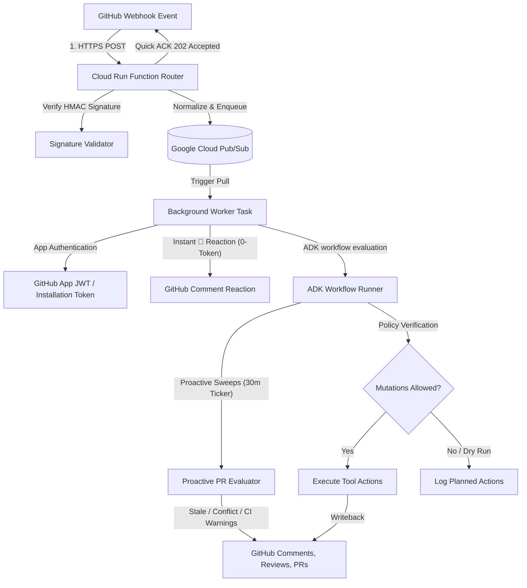

# 🤖 Hannibal Hub Agents: Distributed GitHub App Webhook Orchestrator

A unified, event-driven service that handles GitHub webhooks via a serverless router, queues event processing asynchronously using **Google Cloud Pub/Sub**, and runs an agentic workflow powered by **Gemini 3.8 / 3.5 Flash**, **Google GenAI**, & **Google ADK** to safely orchestrate GitHub repository reviews, conflict resolutions, and proactive code health sweeps.

---

## 🏗️ System Architecture

The orchestrator uses a decoupled, distributed architecture with a current ADK workflow runner and **Proactive PR Evaluator**:


```mermaid
flowchart TD
    GH["GitHub Webhook Event"] -->|"1. HTTPS POST"| Router["Cloud Run Function Router"]
    Router -->|"Verify HMAC Signature"| Auth["Signature Validator"]
    Router -->|"Quick ACK 202 Accepted"| GH
    Router -->|"Normalize & Enqueue"| Queue[("Google Cloud Pub/Sub")]
    
    Queue -->|"Trigger Pull"| Worker["Background Worker Task"]
    Worker -->|"App Authentication"| Creds["GitHub App JWT / Installation Token"]
    Worker -->|"Instant 👀 Reaction (0-Token)"| GH_React["GitHub Comment Reaction"]
    Worker -->|"ADK workflow evaluation"| StateGraph["ADK Workflow Runner"]
    StateGraph -->|"Proactive Sweeps (30m Ticker)"| Proactive["Proactive PR Evaluator"]
    Proactive -->|"Stale / Conflict / CI Warnings"| GH_Write
    
    StateGraph -->|"Policy Verification"| Policy{"Mutations Allowed?"}
    Policy -->|"Yes"| Exec["Execute Tool Actions"]
    Policy -->|"No / Dry Run"| Log["Log Planned Actions"]
    
    Exec -->|"Writeback"| GH_Write["GitHub Comments, Reviews, PRs"]
```

---

## 📁 Repository Structure

```
├── .agents/skills/          # Localized agent operational skills
│   ├── gcloud-logging/      # GCP logging inspection protocol & project matrix
│   └── github-pr-manager/   # End-to-end GitHub PR lifecycle management
├── .github/workflows/
│   └── deploy.yml           # Automated CI/CD deployment to VM via IAP SSH
├── scripts/
│   ├── load_secrets.sh      # Load environment variables dynamically from GCP Secret Manager
│   ├── migrate_pubsub_messages.py # Pub/Sub backlog migration helper
│   ├── setup_vm_user_service.sh   # VM user-space systemd service setup script
│   ├── hannibal-webhook-agent.service # User-space systemd unit file template
│   ├── publish_test_message.py    # Test webhook payload publisher
│   └── install-git-hooks.sh       # Pre-commit hook installer for lint & type validation
├── src/
│   ├── webhook_agent/         # Core Webhook Orchestrator Package
│       ├── core/            # Core ADK WebhookAgent definition, loop helpers, and GitHub tools
│       ├── logic/           # Model chain routing, writeback policy, and rate limiting
│       ├── review/          # Code review verdict enforcement, scorecard parsing, and guarded submission
│       ├── worker.py        # Pub/Sub subscriber entry point and main polling loop
│       ├── processor.py     # Event routing, deduplication, 👀 reaction, & ADK agent execution
│       ├── webhook_agent.py # Thin backwards-compatible façade re-exporting core agent and tools
│       ├── proactive_service.py # Proactive PR evaluator for stale threads, conflicts, & CI runs
│       ├── schemas.py       # Pydantic response models & universal markdown string field validators
│       ├── formatter.py     # GitHub Flavored Markdown renderer for code reviews & sync reviews
│       ├── bot_identity.py  # Multi-signal bot identity detection for loop avoidance
│       ├── memory_service.py # ADK agent memory and session persistence service
│       ├── github_credential_helper.py # GitHub App JWT generation & cached installation tokens
│       ├── webhook_types.py # Common dataclasses and ActionResult definitions
│       ├── tools/           # AST analysis, diff tools, search, and codebase utilities
│       └── templates/       # Local prompt & code review templates
├── tests/
│   ├── eval/                # Continuous quality evaluation datasets & configs
│   ├── fixtures/            # Sample webhook payloads & review event fixtures
│   └── unit/                # Unified test suite (webhook_agent, logic, callbacks)
├── main.py                  # Distributed process manager entry point
├── pyproject.toml           # Dependency & pytest specification (uv-compatible)
└── README.md                # Repository documentation
```

---

## ⚡ High-Efficiency Token Optimization & Advanced Features

The project includes built-in strategies to maximize context efficiency, eliminate unnecessary LLM calls, and execute 1-turn webhook responses:

1. **ADK workflow evaluation**:
   - Event scope is classified by the deterministic scope router.
   - Pull-request context and diffs are hydrated before model evaluation.
   - Structured review output is normalized before writeback.
2. **Proactive PR Evaluator (`ProactiveEvaluator`)**:
   - Runs a 30-minute background ticker in the worker process.
   - Scans open PRs for:
     - **Stale Review Threads**: Unresolved review feedback idle >24h ➔ Posts soft reminder comment.
     - **Merge Conflicts**: Target branch conflicts (`mergeable_state == "dirty"`) ➔ Posts conflict warning comment.
     - **Failing CI Runs**: Failed status check runs ➔ Posts targeted diagnostic recommendations.
3. **Universal Pydantic Field Validators (`clean_field_string`)**:
   - Strips leading Markdown bullets, emoji badges, or key label prefixes (`Update Summary:**`, `**Executive Summary:**`) across all Pydantic schemas (`CodeReviewResponse`, `SyncReviewResponse`, `IssueItem`, `RiskItem`, `SyncResolutionItem`) to eliminate redundant label echo in generated markdown.
4. **Tier-Aware Model Chains & 503 Failover**:
   - Dynamically routes requests based on active environment tier (`WEBHOOK_TIER`).
   - Cascades from primary models (`gemini-3.8-flash` on paid, `gemini-3.5-flash-lite` on free) through Flash-Lite and Gemma tiers.
   - Features instant `0.5s` failover on `503 UNAVAILABLE` high-demand server spikes while preserving 429 rate limit backoff.
5. **Resolution Tracking & Re-Review Templates**:
   - Tracks **`[RESOLVED]`** vs **`[UNRESOLVED]`** items across commits using structured schema validation.
6. **Guarded Programmatic 👀 Reaction**:
   - Adds an `eyes` reaction to user comments and valid PR events once closed/merged PR checks and deduplication locks pass.
7. **Dual-Engine Architecture (Automated Reviews + Conversational Pair Programming)**:
   - Eliminates rigid slash command requirements: automatically conducts formal clinical reviews on PR lifecycle events (`pull_request.opened`, `pull_request.synchronize`, `pull_request.ready_for_review`).
   - Supports natural-language pair programming, architecture Q&A, and discussion on PR threads, while seamlessly routing to full re-audits whenever review intent is detected (`please review`, `audit this`, `/review`).

---

## 🚀 Getting Started

### 1. Installation
This project uses `uv` for lightning-fast dependency management:

```bash
# Sync dependencies and set up the virtual environment
uv sync

# Install the tracked pre-commit hook for this clone
./scripts/install-git-hooks.sh
```

The installer configures `core.hooksPath=.githooks` locally. The official hook then runs
pre-commit linting and type checks for every commit and re-stages only Python files that were already
staged. It never adds an unstaged Python file to the commit.

### 2. Running Tests
Run the full test suite (including token optimization, proactive evaluator, ADK AgentCore, and worker tests):

```bash
uv run pytest
```

---

## 🛠️ Operations & Deployment

### Running the Background Worker
Start the worker process locally:

```bash
uv run python main.py
```

### VM Deployment & User-Space Systemd Service
On the target VM (`hannibal-hub-free`), the agent runs as a user-space systemd service (`hannibal-webhook-agent.service`):

```bash
# Initialize and start the user-space systemd service
bash scripts/setup_vm_user_service.sh

# Monitor service status on VM
systemctl --user status hannibal-webhook-agent.service

# Restart service on VM
systemctl --user restart hannibal-webhook-agent.service

# Follow live service logs
journalctl --user -u hannibal-webhook-agent.service -f
```

All pushes to `main` automatically trigger [`.github/workflows/deploy.yml`](file:///.github/workflows/deploy.yml) to deploy code updates and restart `hannibal-webhook-agent.service` via IAP SSH!
