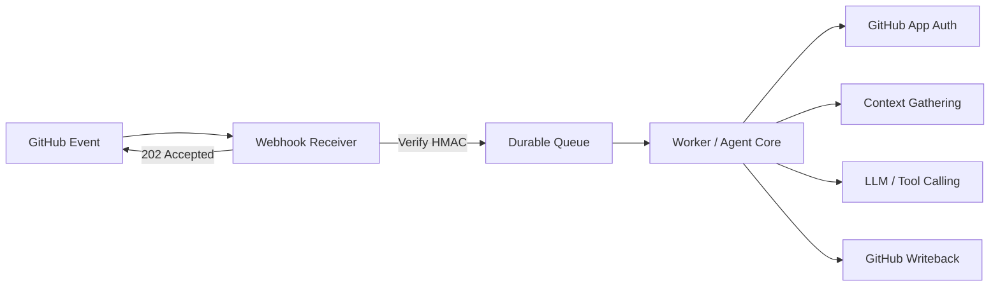

# Standalone GitHub App Webhook Agent Plan

## Project Boundary

This is a **separate project** from Hannibal Hub / `chatbot-repo`.

It should have its own:

- repository
- CI/CD pipeline
- secrets and environment variables
- queue or job runner
- worker processes
- observability and alerting
- release lifecycle

This document intentionally treats Hannibal Hub only as an architectural reference point. It does **not** assume any shared runtime, shared code, or shared deployment path.

## Goal

Build a GitHub App–based agent service that can:

- receive GitHub webhooks
- verify webhook authenticity
- enqueue work immediately
- process events asynchronously
- gather repository or pull request context
- call an LLM with tool support
- write results back to GitHub as comments, reviews, or optional code changes

## Non-Goals

- No integration with Hannibal Hub runtime or source tree
- No shared deployment process with `chatbot-repo`
- No direct writes to a primary branch without explicit policy controls
- No in-process webhook handling as the production execution model
- No hardcoded secrets

## High-Level Architecture

## Phase 1: GitHub App Setup

Create a GitHub App for the standalone service.

### Required Elements

- webhook secret
- app ID
- private key
- installation access token flow
- least-privilege permissions

### Recommended Permissions

Start small and add only what the agent actually needs:

- **Issues**: read/write, if the agent will comment on issues
- **Pull Requests**: read/write, if the agent will review PRs or comment on them
- **Contents**: read/write, only if the agent will commit code or update branches
- **Metadata**: read-only, as required by GitHub

### Event Subscriptions

Subscribe only to the events the agent will handle:

- `issue_comment`
- `pull_request`
- `pull_request_review_comment`
- `pull_request_review` if the agent reacts to submitted reviews

## Phase 2: Webhook Receiver

The webhook receiver should do the minimum possible work:

1. read the raw request body
2. verify the GitHub signature
3. check the delivery ID for idempotency
4. enqueue a job
5. return `202 Accepted`

### Receiver Rules

- do not perform LLM work in the request thread
- do not perform repo analysis in the request thread
- do not depend on in-memory state for correctness
- do not assume deliveries are unique

## Phase 3: Durable Queue

Use a real queue, not an in-process background task.

### Queue Requirements

- persistence across restarts
- retry policy with backoff
- dead-letter handling or equivalent failure capture
- idempotency keyed by GitHub delivery ID
- visibility into job state

### Queue Choice

Pick the simplest option that fits the deployment environment:

- Cloud Tasks
- Pub/Sub
- Redis + a real worker framework
- another managed queue with durable retries

## Phase 4: Worker and GitHub Authentication

The worker processes queued jobs and acts as the GitHub App installation.

### Authentication Flow

- generate a GitHub App JWT
- exchange the JWT for an installation access token
- cache the token until it expires
- refresh automatically when needed

### Context Gathering

Collect only the context required for the current event:

- issue or PR metadata
- comments and review threads
- changed files
- relevant patch hunks
- checks or status context when useful

### Safety Notes

- prefer the narrowest API calls that solve the task
- avoid fetching more context than needed
- do not trust webhook payloads without verification

## Phase 5: Agent Core

Use the current Google GenAI agent pattern with tool declarations and explicit execution.

### Agent Design

- define a stable system instruction
- define tools with strict schemas
- validate tool arguments before execution
- keep side effects behind policy checks
- preserve a trace ID across turns and jobs

### Model Selection

Choose the model intentionally based on the task:

- start with the model that best fits coding and reasoning workloads
- verify context limits and rate limits before committing to production
- avoid designing the system around an unverified model-card claim

### Tooling Rules

- the model suggests tool calls
- the application executes them
- tool output returns to the model only when needed
- do not let the model directly mutate infrastructure or files without explicit guards

## Phase 6: GitHub Writeback

After the agent finishes its analysis, write back to GitHub in a controlled way.

### Allowed Writebacks

- issue comments
- PR review comments
- review submissions
- branch updates or commits only when policy allows it

### Writeback Rules

- keep human review in the loop for code changes unless policy says otherwise
- never write to unrelated repositories
- never assume a webhook event grants permission to mutate code
- make writeback actions auditable and idempotent

## Operational Requirements

### Logging

Log every meaningful state transition:

- webhook received
- signature verified
- job queued
- job started
- auth token acquired
- context fetched
- model call started
- model call completed
- writeback completed
- job failed

### Error Handling

- retry transient failures
- surface permanent failures clearly
- preserve the failing payload for investigation when safe to do so
- apply backpressure if the queue or model provider is saturated

### Secrets

Store all secrets in the standalone project’s own secret manager or environment store.

Do not reuse Hannibal Hub secrets, env files, or deployment credentials.

## Acceptance Criteria

The project is ready when all of the following are true:

- a webhook delivery is acknowledged within 10 seconds
- the same delivery is processed only once
- the worker can authenticate as the GitHub App installation
- the agent can gather repo context and call the model
- the agent can write comments or reviews back to GitHub
- logs show the full lifecycle of a delivery
- the service remains independent from Hannibal Hub / `chatbot-repo`

## Step-By-Step Build Checklist

Use this as the practical implementation order for the standalone service.

### 1. Set the project boundary

- [x] Create a new repository for the webhook agent service
- [x] Choose a separate deployment target
- [x] Create separate secret storage and environment variables
- [x] Define the repo as independent from Hannibal Hub / `chatbot-repo`

### 2. Register the GitHub App

- [x] Create the GitHub App in GitHub settings
- [x] Generate the webhook secret
- [x] Generate and store the private key
- [x] Record the App ID
- [x] Select the minimal permissions needed for the first release
- [x] Subscribe to the webhook events the app will actually handle

### 3. Scaffold the service

- [x] Create the standalone FastAPI app for webhook ingress
- [x] Add a health endpoint
- [x] Add config loading for secrets, queue settings, and model settings
- [x] Add structured logging from the start

### 4. Build webhook verification

- [x] Read the raw request body
- [x] Verify the GitHub HMAC signature
- [x] Reject invalid signatures immediately
- [x] Capture the GitHub delivery ID for idempotency
- [x] Return `202 Accepted` as soon as the job is enqueued

### 5. Add durable job processing

- [x] Choose the queue or broker
- [x] Implement enqueue logic from the webhook receiver
- [x] Implement worker consumption logic
- [x] Add retry policy and backoff
- [x] Add dead-letter handling or a failure sink
- [x] Confirm a restarted process does not lose work

### 6. Implement GitHub App authentication

- [x] Generate a JWT from the app private key
- [x] Exchange the JWT for an installation access token
- [x] Cache installation tokens until near expiry
- [x] Refresh tokens automatically when needed

### 7. Gather event context

- [x] Fetch issue or pull request metadata
- [x] Fetch comments and review threads
- [x] Fetch changed files and patch hunks
- [ ] Fetch checks or status context when useful
- [x] Limit each event to only the context it needs

### 8. Build the agent core

- [x] Define the system instruction
- [x] Define strict tool schemas
- [x] Validate all tool arguments before execution
- [x] Use the current Google GenAI Interactions API pattern
- [x] Keep side effects behind explicit policy checks
- [x] Preserve a trace ID across queue, worker, model, and writeback steps

### 9. Implement GitHub writeback

- [x] Add issue comments
- [x] Add PR review comments
- [x] Add review submissions if needed
- [x] Add branch or commit updates only if policy allows them
- [x] Make writebacks idempotent

### 10. Add operational guardrails

- [x] Log each major lifecycle transition
- [x] Record job success and failure states
- [x] Handle transient errors with retries
- [x] Surface permanent failures clearly
- [ ] Apply backpressure when the queue or model provider is saturated
- [x] Store secrets outside the codebase

### 11. Validate the first release

- [x] Confirm every webhook returns within 10 seconds
- [x] Confirm duplicate deliveries do not produce duplicate side effects
- [x] Confirm the worker can authenticate as the GitHub App installation
- [x] Confirm the agent can gather context and call the model
- [x] Confirm the agent can write back to GitHub safely
- [x] Confirm the project remains fully separate from Hannibal Hub

## Open Questions

- Which queue or broker best fits the target deployment?
- Answer: Unsure
- Should the first release support comments only, or comments plus PR reviews?
- Answer: Both
- Should branch writes be disabled by default?
- Answer: No
- Which model should be the production default after validation?
- Answer: gemma-4-31b-it and gemma-4-26b-4a-it
- Which policies should gate mutation actions versus read-only analysis?
- Answer: Unsure

## Final Boundary Reminder

This project is intentionally **not** part of Hannibal Hub.

It may borrow ideas from Hannibal Hub’s architecture, but it should not import its code, share its runtime, or depend on its deployment pipeline.
