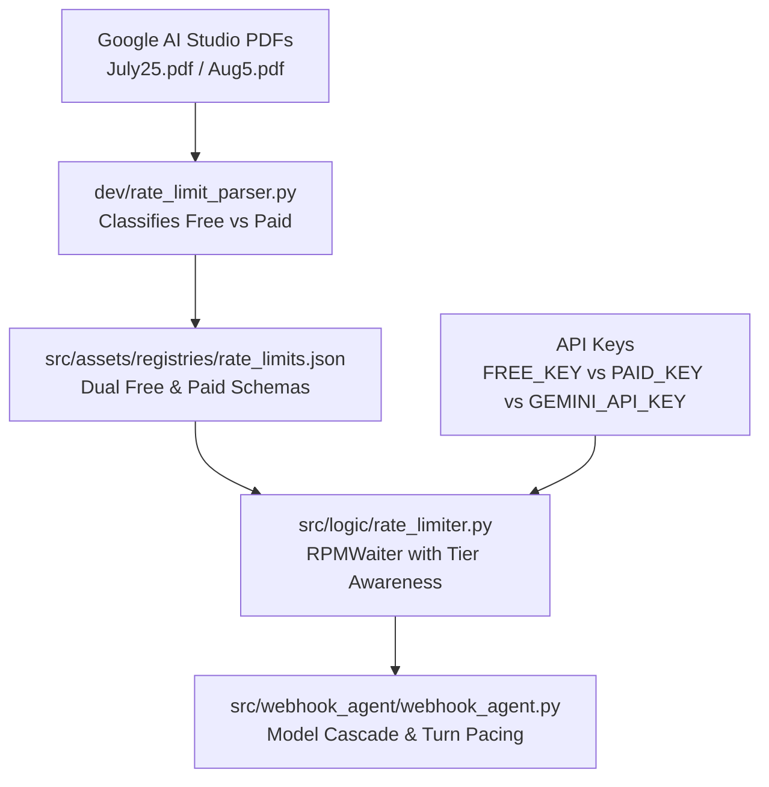

# Handoff Plan: Porting Dual-Tier Model Registry & Tier-Aware Rate Limiting to `hannibal-hub-agents`

This document serves as an exhaustive, self-contained handoff specification for an agent or maintainer working inside the sandboxed `hannibal-hub-agents` repository. It provides complete code patterns, architecture diagrams, data schemas, and step-by-step instructions to replicate the Dual-Tier (Free & Paid) Model Registry and Rate Limiter engine built in `hannibal-hub`.

---

## Architectural Context & Problem Statement

In `hannibal-hub-agents`, agent execution (e.g. `webhook_agent`, `token_optimized_agent`) relies on model cascading across Flash and Gemma models. Currently, documentation and rate-limit tracking hardcode **Paid Tier (Tier 1)** limits (e.g., 4M TPM for `gemini-3.5-flash-lite`, 2M TPM for `gemini-3.6-flash`).

When running under `FREE_KEY` (Free Tier), those limits drop significantly (e.g., **250,000 TPM** and **15 RPM** for `gemini-3.5-flash-lite`, **5 RPM** for Flash models). Without dynamic tier awareness:
1. Agents hit unhandled `429 RESOURCE_EXHAUSTED` rate-limit spikes.
2. Intra-window RPM spacing delays requests artificially or undershoots sliding-window TPM calculations.
3. Model chain fallbacks do not know whether `PAID_KEY` (Paid Tier 1) or `FREE_KEY` (Free Tier 0) is active.

### Key Naming & `GEMINI_API_KEY` Tier Resolution Protocol

In `hannibal-hub-agents`, API keys are named **`FREE_KEY`** (Free Tier 0) and **`PAID_KEY`** (Paid Tier 1).

The rate limiter dynamically resolves the tier using this exact resolution cascade:
1. **Explicit Override:** If `WEBHOOK_TIER` environment variable is explicitly set (`"free"` or `"paid"`), use it.
2. **Active Key Match:** If `GEMINI_API_KEY` (or `GOOGLE_API_KEY`) is active in the execution environment:
   - If `GEMINI_API_KEY == PAID_KEY` -> Tier is `"paid"`.
   - If `GEMINI_API_KEY == FREE_KEY` -> Tier is `"free"`.
3. **Presence Fallback:** If `PAID_KEY` exists and is non-empty/non-dummy -> Tier is `"paid"`. Otherwise -> Tier is `"free"`.

---

## Core Components to Port



---

## Component Code Snippets & Specs

### 1. Dual-Tier System Registry Schema
**Target File in `hannibal-hub-agents`:** `src/assets/registries/rate_limits.json`

```json
{
    "models/gemini-3.5-flash-lite": {
        "free": { "rpm": 15, "tpm": 250000, "rpd": 500.0 },
        "paid": { "rpm": 4000, "tpm": 4000000, "rpd": 150000.0 },
        "rpm": 4000,
        "tpm": 4000000,
        "rpd": 150000.0
    },
    "models/gemini-3.6-flash": {
        "free": { "rpm": 5, "tpm": 250000, "rpd": 20.0 },
        "paid": { "rpm": 1000, "tpm": 2000000, "rpd": 10000.0 },
        "rpm": 1000,
        "tpm": 2000000,
        "rpd": 10000.0
    },
    "models/gemini-2.5-flash": {
        "free": { "rpm": 5, "tpm": 250000, "rpd": 20.0 },
        "paid": { "rpm": 1000, "tpm": 1000000, "rpd": 10000.0 },
        "rpm": 1000,
        "tpm": 1000000,
        "rpd": 10000.0
    },
    "models/gemma-4-31b-it": {
        "free": { "rpm": 30, "tpm": 16000, "rpd": 14400.0 },
        "paid": { "rpm": 30, "tpm": 16000, "rpd": 14400.0 },
        "rpm": 30,
        "tpm": 16000,
        "rpd": 14400.0
    },
    "models/gemma-4-26b-a4b-it": {
        "free": { "rpm": 30, "tpm": 16000, "rpd": 14400.0 },
        "paid": { "rpm": 30, "tpm": 16000, "rpd": 14400.0 },
        "rpm": 30,
        "tpm": 16000,
        "rpd": 14400.0
    }
}
```

> **⚠️ Registry Coverage Note (verified against `hannibal-hub` source):**
> - `gemma-4-26b-a4b-it` is **required** — it is the actual `_FALLBACK_MODEL` default in `webhook_agent.py` (line 671) and appears in the source registry. The original plan omitted it.
> - The source registry also contains `models/gemini-2.0-flash` and `models/gemini-2.0-flash-lite` with **`free: {rpm: 0, tpm: 0, rpd: 0.0}`** (zero quota on Free Tier). These MUST be included so the `RPMWaiter` zero-quota fast-fail (see Section 3) rejects them on Free Tier instead of hanging.
> - The top-level `rpm`/`tpm`/`rpd` keys (paid defaults) are legacy and only used as a fallback when no tier entry matches; they are harmless but not required.

---

### 2. PDF Classification & Ingestion Engine
**Target File in `hannibal-hub-agents`:** `dev/rate_limit_parser.py`

Key logic needed for Free vs Paid PDF classification and schema building:

```python
"""
Rate Limit PDF Parser & Dual-Tier Generator
============================================
Classifies vendor PDFs into 'free' or 'paid' tier reports and outputs dual-tier JSON schemas.
"""

import argparse
import json
import logging
import re
from pathlib import Path
from typing import Any
import pypdf

logger = logging.getLogger("rate_limit_parser")


def classify_pdf(raw_text: str) -> str:
    """Determines if PDF text represents a 'paid' tier (Tier 1+) or 'free' tier rate limit document."""
    text_lower = raw_text.lower()
    if "free tier" in text_lower or "tier 0" in text_lower:
        return "free"
    if (
        "tier 1" in text_lower
        or "pay-as-you-go" in text_lower
        or "tier 2" in text_lower
        or "chatbot-project-hannibal" in text_lower
    ):
        return "paid"
    return "free"


def parse_scaled_value(val: Any) -> float:
    if not val or val == "-":
        return 0.0
    val_str = str(val).strip().upper()
    if val_str == "UNLIMITED":
        return 1000000.0
    multiplier = 1.0
    if val_str.endswith("K"):
        multiplier = 1000.0
        val_str = val_str[:-1]
    elif val_str.endswith("M"):
        multiplier = 1000000.0
        val_str = val_str[:-1]
    elif val_str.endswith("B"):
        multiplier = 1000000000.0
        val_str = val_str[:-1]
    try:
        return float(val_str.replace(",", "")) * multiplier
    except ValueError:
        return 0.0


def extract_tier_entry(entry_data: dict | None) -> dict[str, float | int]:
    if not entry_data:
        return {"rpm": 15, "tpm": 0, "rpd": 0.0}
    return {
        "rpm": int(parse_scaled_value(entry_data.get("RPM", "0"))),
        "tpm": int(parse_scaled_value(entry_data.get("TPM", "0"))),
        "rpd": parse_scaled_value(entry_data.get("RPD", "0")),
    }
```

---

### 3. Tier-Aware Sliding Window `RPMWaiter` Engine
**Target File in `hannibal-hub-agents`:** `src/logic/rate_limiter.py` (or `src/webhook_agent/rate_limiter.py`)

This is the ported code from `hannibal-hub` that fixes model key lookups (`models/` normalization), multi-request sliding window TPM expiration, and burst RPM handling.

> **⚠️ Correction to the original plan:** This is **NOT** the "exact pristine code" from `hannibal-hub`. The source `src/hannibal/logic/rate_limiter.py` resolves tier via `CHAT_KEY` + `CHATBOT_TIER` (from `hannibal.infra.config`), **not** via `FREE_KEY`/`PAID_KEY`/`GEMINI_API_KEY`. The tier-resolution block below is a **deliberate adaptation** for `hannibal-hub-agents`' key naming. Additionally, the source contains a **zero-quota fast-fail** that the original plan dropped — it is restored below (see the `ValueError` block). This fast-fail is **critical**: on Free Tier, `gemini-2.0-flash` and `gemini-2.0-flash-lite` have 0 RPM/RPD and must be rejected immediately rather than hanging or sleeping.

```python
"""
Rate Limiter for Hannibal Hub Agents API calls.
"""

import asyncio
import collections
import json
import logging
import time
from collections.abc import Callable
from pathlib import Path
from typing import Any

logger = logging.getLogger("hannibal_rate_limiter")


def _load_rate_limits(registry_path: Path) -> dict[str, dict[str, Any]]:
    """Dynamically load rate limits (rpm and tpm) for free and paid tiers from registry JSON."""
    try:
        if registry_path.exists():
            return json.loads(registry_path.read_text(encoding="utf-8"))
    except Exception as e:
        logger.error("Failed to load rate_limits.json: %s", e)
    return {}


class RPMWaiter:
    def __init__(
        self,
        registry_path: Path | None = None,
        default_limit: int = 10,
        window: float = 60.0,
        clock: Callable[[], float] = time.monotonic,
    ):
        self.default_limit = default_limit
        self.window = window
        self.histories: dict[str, list[float]] = collections.defaultdict(list)
        self.token_histories: dict[str, list[Any]] = collections.defaultdict(list)
        self.lock = asyncio.Lock()
        self.clock = clock
        self.registry_path = registry_path or (
            Path(__file__).parents[1] / "assets" / "registries" / "rate_limits.json"
        )
        self.model_limits = _load_rate_limits(self.registry_path)

    async def check_and_wait(
        self,
        model: str = "default",
        rpm_override: int | None = None,
        estimated_tokens: int = 0,
        tier: str | None = None,
    ) -> None:
        wait_time = 0.0

        if not tier:
            import os

            # hannibal-hub-agents Key Resolution Protocol
            free_key = os.getenv("FREE_KEY")
            paid_key = os.getenv("PAID_KEY")
            active_gemini_key = os.getenv(
                "GEMINI_API_KEY", os.getenv("GOOGLE_API_KEY", "")
            )

            # Resolve tier by comparing active GEMINI_API_KEY against FREE_KEY and PAID_KEY
            if active_gemini_key and paid_key and active_gemini_key == paid_key:
                inferred_tier = "paid"
            elif active_gemini_key and free_key and active_gemini_key == free_key:
                inferred_tier = "free"
            elif paid_key and paid_key.lower() != "dummy":
                inferred_tier = "paid"
            else:
                inferred_tier = "free"

            tier = os.getenv("CHATBOT_TIER", inferred_tier).lower()

        full_model_key = model if model.startswith("models/") else f"models/{model}"
        model_entry = self.model_limits.get(
            model, self.model_limits.get(full_model_key, {})
        )
        if isinstance(model_entry, dict) and tier in model_entry:
            tier_entry = model_entry[tier]
        else:
            tier_entry = model_entry if isinstance(model_entry, dict) else {}

        rpm_limit = (
            rpm_override
            if rpm_override is not None
            else tier_entry.get("rpm", self.default_limit)
        )
        # Zero-quota fast-fail: reject models with 0 RPM/RPD on the active tier
        # (e.g. gemini-2.0-flash / gemini-2.0-flash-lite on Free Tier) immediately.
        if (
            rpm_override is None
            and tier_entry
            and (tier_entry.get("rpm") == 0 or tier_entry.get("rpd") == 0.0)
        ):
            logger.warning(
                "FAST FAIL (%s): Model has 0 quota on tier '%s'. Rejecting.",
                model,
                tier,
            )
            raise ValueError(
                f"Model '{model}' is unavailable on tier '{tier}' (0 quota)."
            )

        if rpm_limit <= 0:
            rpm_limit = self.default_limit

        tpm_limit = tier_entry.get("tpm", 0)

        async with self.lock:
            now = self.clock()
            history = self.histories[model]
            token_history = self.token_histories[model]

            # Prune old RPM & TPM histories
            history[:] = [t for t in history if now - t <= self.window]
            token_history[:] = [
                entry for entry in token_history if now - entry[0] <= self.window
            ]

            # 1. RPM Check (bursts allowed up to limit)
            wait_rpm = 0.0
            if len(history) >= rpm_limit:
                oldest_ts = history[0]
                wait_rpm = max(0.1, (oldest_ts + self.window) - now)
                logger.warning(
                    "RPM THROTTLE (%s): Used %d/%d. Sleeping %.1fs...",
                    model,
                    len(history),
                    rpm_limit,
                    wait_rpm,
                )

            # 2. TPM Check (exact sliding window token expiration)
            wait_tpm = 0.0
            if tpm_limit > 0 and estimated_tokens > 0:
                active_tpm = sum(tok for _, tok, _ in token_history)
                if active_tpm + estimated_tokens > tpm_limit:
                    needed_tokens_to_expire = (
                        active_tpm + estimated_tokens
                    ) - tpm_limit
                    accumulated = 0
                    required_ts = now
                    for entry in token_history:
                        ts, tok = entry[0], entry[1]
                        accumulated += tok
                        required_ts = ts
                        if accumulated >= needed_tokens_to_expire:
                            break
                    wait_tpm = max(0.1, (required_ts + self.window) - now)
                    logger.warning(
                        "TPM THROTTLE (%s): Active %d+%d/%d TPM limit exceeded. Waiting %.1fs for tokens to expire...",
                        model,
                        active_tpm,
                        estimated_tokens,
                        tpm_limit,
                        wait_tpm,
                    )

            wait_time = max(wait_rpm, wait_tpm)

            # Reserve slot
            history.append(now + wait_time)
            if estimated_tokens > 0:
                token_history.append([now + wait_time, estimated_tokens, False])

        if wait_time > 0:
            await asyncio.sleep(wait_time)

    async def record_actual_tokens(
        self, model: str = "default", actual_tokens: int = 0
    ) -> None:
        """Update or record real token usage returned in API response."""
        if actual_tokens <= 0:
            return

        async with self.lock:
            now = self.clock()
            token_history = self.token_histories[model]

            token_history[:] = [
                entry for entry in token_history if now - entry[0] <= self.window
            ]

            unfinalized = next((entry for entry in token_history if not entry[2]), None)
            if unfinalized:
                unfinalized[1] = actual_tokens
                unfinalized[2] = True
            else:
                token_history.append([now, actual_tokens, True])


rpm_waiter = RPMWaiter()
```

---

### 4. Bot Self-Awareness & Duplicate Review Suppression Engine
**Target Files in `hannibal-hub-agents`:** `src/webhook_agent/webhook_agent.py` & `src/webhook_agent/processor.py`

To prevent `hannibal-hub-agents[bot]` from double-posting reviews when a `git push` (`pull_request.synchronize`) and PR comment (`issue_comment.created`) arrive simultaneously:

#### A. Updated `SYSTEM_INSTRUCTION` Self-Awareness Rules
Add explicit self-awareness guardrails to `SYSTEM_INSTRUCTION` in `src/webhook_agent/webhook_agent.py`:

```python
SYSTEM_INSTRUCTION = f"""You are a skilled autonomous GitHub Webhook Agent for the Hannibal Hub ecosystem.

Your reasoning process follows 6 steps:

1. **Understand Intent & Context**: Analyze the incoming event, user sender, PR/issue details, and conversation history.
2. **Autonomous Action Decision & Self-Awareness**:
   - Before calling review(), check recent review history on the PR.
   - **DUPLICATE SUPPRESSION RULE**: If you (hannibal-hub-agents[bot]) already submitted a formal review for the PR within the last 120 seconds or for the current head commit SHA, **DO NOT** submit another formal review!
   - When responding to user comments like "I have addressed the feedback and pushed commit X": If the PR is already reviewed/approved, acknowledge with a plain comment via add_comment(issue_number, body=...) or a reaction, rather than invoking review().
   - **NOTE:** `update_issue` no longer accepts a `comment` parameter (see Section 5H) — use `add_comment` for thread chat.
   - If the event is routine metadata without a command or question, respond in plain text explaining why no tool call is needed.
"""
```

#### B. Event Deduplication Window in `WebhookAgent.plan_and_execute`
Pass recent activity context into the turn prompt so the model is aware of recent reviews:

> **⚠️ Correction to the original plan:** `InMemorySessionService` (ADK) has **no `get_state()`/`set_state()` methods**. State must be tracked via the ADK `session.state` dict (or a small wrapper keyed by `session_id`). The snippet below is illustrative — implement it by reading/writing `session.state["last_review_timestamp"]` after fetching the session in `_run()`, or add a thin `ReviewStateStore` helper. Also note: the `turn_prompt` variable does not exist in the current `plan_and_execute`; the dedup notice must be appended to the user message text built in `_build_user_message()` (or injected into `user_message.parts[0].text`).

```python
# Pass recent review metadata into user turn prompt context
# NOTE: get_state/set_state do NOT exist on InMemorySessionService.
# Use session.state instead, e.g.:
#   session = await self._session_service.get_session(app_name, user_id, session_id)
#   last_review_ts = (session.state or {}).get("last_review_timestamp", 0)
last_review_ts = self._session_service.get_state(session_id, "last_review_timestamp", 0)
now = time.time()
time_since_review = now - last_review_ts

if time_since_review < 30.0:
    turn_prompt += (
        f"\n\n[⚠️ SYSTEM NOTICE: You submitted a formal PR review {time_since_review:.1f} seconds ago. "
        "Do NOT call review() again unless explicitly requested by a new /review command.]"
    )
```

---

### 5. Agent Intelligence & Review Fidelity Upgrades
**Target Files in `hannibal-hub-agents`:** `src/webhook_agent/webhook_agent.py` & `src/webhook_agent/templates/`

To prevent hallucinations, ensure stateful review resolution, and standardize review formatting:

#### A. Mandatory Tool-Grounded Verification Rule (`SYSTEM_INSTRUCTION`)
Add an explicit grounding pre-check rule to `SYSTEM_INSTRUCTION`:

```python
SYSTEM_INSTRUCTION += """
Grounding Pre-Check Rule: Before claiming that code, teardown blocks, or unit tests are missing in a PR review:
1. You MUST call read_file() or search_agent() to inspect the target files first.
2. Never suggest creating a unit test file or adding cleanup logic without first verifying existing tests in tests/ or teardown blocks in the target module.
"""
```

#### B. Stateful Review Thread Resolution (`SessionService`)
Pass the agent's previous review critique from session state into follow-up turn prompts:

> **⚠️ Correction to the original plan:** As in Section 4B, `get_state()`/`set_state()` do **not** exist on `InMemorySessionService`. Read/write `session.state["last_review_critique"]` instead (after fetching the session in `_run()`), and append the critique to the user message text in `_build_user_message()`.

```python
# NOTE: get_state/set_state do NOT exist on InMemorySessionService.
# Use session.state instead, e.g.:
#   session = await self._session_service.get_session(app_name, user_id, session_id)
#   previous_critique = (session.state or {}).get("last_review_critique", "")
previous_critique = self._session_service.get_state(
    session_id, "last_review_critique", ""
)
if previous_critique:
    turn_prompt += (
        f"\n\n[YOUR PREVIOUS REVIEW CRITIQUE]:\n{previous_critique}\n"
        "Verify line-by-line which specific items were resolved by the new commit."
    )
```

#### C. Elimination of Hardcoded Truncation (Full Diff Context)
Gemini 3.5 Flash / 3.6 Flash / Flash Lite models feature **1M to 2M token context windows**. Hardcoded patch truncation (`MAX_FILE_PATCH_CHARS = 1500`, `MAX_DIFF_TOKENS = 2500`) is an obsolete bottleneck that causes the model to hallucinate missing code.

Remove artificial character/token truncation in `get_issue()` and `read_file()`, passing complete 100% diff patches to the model. Token safety is handled dynamically and safely by `RPMWaiter`:

> **⚠️ Correction to the original plan:** The plan only addressed `MAX_FILE_PATCH_CHARS`, but `get_issue()` also applies a whole-diff `MAX_DIFF_TOKENS` cap (via `_truncate_text_to_token_limit(diff_text, max_tokens=MAX_DIFF_TOKENS, ...)`) and `read_file()` applies `MAX_DIFF_TOKENS` to file contents. **All three** must be removed/relaxed. Also note: the current `MAX_INPUT_TOKENS = 3500` / `MAX_DIFF_TOKENS = 2500` caps exist to protect the Gemma 4 16k TPM budget. **Do not remove truncation until the tier-aware `RPMWaiter` (Section 3) is active** — otherwise you risk 429s. This step is gated on Step 2 of the checklist.

```python
# In get_issue(): Pass full file patches directly without arbitrary character truncation
diff_lines.append(
    f"File: {f.filename} ({f.status})\nPatch:\n{f.patch or 'No patch available.'}\n{'-' * 40}"
)
# ALSO remove the whole-diff _truncate_text_to_token_limit(diff_text, max_tokens=MAX_DIFF_TOKENS, ...) call
# AND remove the MAX_DIFF_TOKENS cap in read_file()
```

#### D. Standardized Review Template
Enforce `src/webhook_agent/templates/code_review_template.md` so all reviews use identical pass/fail status badges and Markdown layout.

> **⚠️ Correction to the original plan:** The actual template file is `code_review_template.md`, **not** `review_template.md`. The plan's path was wrong.

#### E. Model-Specific Quotas & Project-Level Key Sharing
According to official Google API Studio rate limit specifications:
- **Rate limits (RPM/TPM/RPD) are per model:** Each model (e.g. `gemini-3.5-flash-lite`, `gemini-3.6-flash`, `gemini-2.5-flash`, `gemma-4-31b-it`) possesses its own independent quota (e.g. 250K TPM each on Free Tier). Hitting a 429 on one model does NOT deplete the quota of another model.
- **Quota is bound to the GCP Project:** Creating multiple API keys (`FREE_KEY_1`, `FREE_KEY_2`) within the same Google Cloud Project shares the exact same project-level model quota pool. To get separate quota pools for testing, API keys must originate from different Google Cloud Projects.

#### F. Incremental Diff Tooling (`get_commit_diff`)
Currently `get_issue(number, include_diff=True)` calls `pr.get_files()`, which fetches the cumulative diff of the entire PR relative to `main`. When a new commit is pushed (`pull_request.synchronize`), the agent re-reviews the entire PR from scratch!

Add `get_commit_diff(base_sha, head_sha)` tool to `src/webhook_agent/webhook_agent.py`:

```python
def get_commit_diff(ctx: Context, base_sha: str, head_sha: str) -> str:
    """Fetch incremental code diff between two commits for PR updates."""
    gh = _get_gh_from_ctx(ctx)
    repo = gh.get_repo(_get_repo_full_name(ctx))
    comparison = repo.compare(base_sha, head_sha)
    diff_lines = [f"Incremental Diff ({base_sha[:7]}..{head_sha[:7]}):\n"]
    for f in comparison.files:
        diff_lines.append(
            f"File: {f.filename} ({f.status})\nPatch:\n{f.patch or 'No patch available.'}\n{'-' * 40}"
        )
    return "\n".join(diff_lines)
```

In `SYSTEM_INSTRUCTION`:
- **PR Opened (`action: "opened"`)**: Use `get_issue(number, include_diff=True)` for full PR evaluation.
- **PR Synchronize (`action: "synchronize"`)**: Call `get_commit_diff(before_sha, head_sha)` to review **ONLY the newly pushed commits**!

#### G. Dynamic PR Review Status Transitions (`REQUEST_CHANGES` vs `APPROVE`)
To ensure GitHub's PR merge gating accurately reflects the agent's review decision:

1. **When Suggestions / Issues Found**:
   - The agent MUST invoke `review(pr_number, body=..., event="REQUEST_CHANGES")`.
   - This sets GitHub's PR state to "Changes requested" and blocks merging until addressed.
2. **When All Feedback / Suggestions Resolved**:
   - When a new commit fixes the issues, the agent MUST invoke `review(pr_number, body=..., event="APPROVE")`.
   - This clears the "Changes requested" block and green-lights the PR for merging.
3. **When Responding to General Questions**:
   - Use `add_comment(number, body=...)` or `review(pr_number, body=..., event="COMMENT")`.

#### H. The 9-Tool Surgical Suite (`add_comment` Added & `get_commit_diff`)
Following the audit of commit `92890df`, add `add_comment` and `get_commit_diff` to establish a 9-tool surgical primitive suite:

> **⚠️ Correction to the original plan:** There is **no** existing `add_comment` function in `webhook_agent.py` — it is a **new** function, not a "resurrection." Also, the list below contains **9** tools, not 8. The current `update_issue` (line 468) has a `comment` parameter that the plan wants to remove; verify no existing prompts/tests depend on `update_issue(comment=...)` before removal.

1. **`read_file(file_path, ref=None)`**: Inspect file contents at ref.
2. **`write_file(file_path, content, message, branch)`**: Create or update source code files.
3. **`get_issue(number, include_diff=False)`**: Fetch issue/PR metadata and full PR branch diff.
4. **`get_commit_diff(base_sha, head_sha)`** [NEW]: Fetch incremental diff of newly pushed commits only (`pull_request.synchronize`).
5. **`update_issue(number, title=None, body=None, labels=None)`** [REFINED]: Edit issue/PR metadata (Title, Description/Body, Labels). (Remove `comment` parameter).
6. **`add_comment(issue_number, body)`** [NEW]: Post standard discussion comments in issue/PR conversation thread without triggering code reviews or editing descriptions.
7. **`open_pr(title, body, head, base)`**: Create pull request.
8. **`merge_pr(pr_number, merge_method="merge")`**: Merge pull request.
9. **`review(pr_number, body, event)`**: Formal PR Code Review (`APPROVE`, `REQUEST_CHANGES`, `COMMENT`).

---

## Step-by-Step Execution Checklist for `hannibal-hub-agents`

> **⚠️ Pre-requisite (NEW, not in original plan):** `processor.py` currently **suppresses `pull_request.synchronize`** in `should_process_event()` (line 141, treated as a "read-only PR lifecycle event"). Before Step 6 can work, you MUST remove `pull_request.synchronize` from that suppression list so synchronize events reach the agent. Also route `synchronize` to the primary model in `_select_model_for_event()` (it currently falls through to the lightweight model).

1. **[NEW] Add Dual-Tier Rate Limits Registry Asset**:
   - Create `src/assets/registries/rate_limits.json` containing dual `free` and `paid` structures with clean model-specific keys.
   - **Include `gemma-4-26b-a4b-it`** (the actual `_FALLBACK_MODEL` default) and the zero-quota Free Tier entries (`gemini-2.0-flash`, `gemini-2.0-flash-lite`) — see Section 1 note.
2. **[NEW] Add `rate_limiter.py` Module & Engine Integration**:
   - Add `src/logic/rate_limiter.py` with `RPMWaiter` (supporting sliding window token pacing, **zero-quota fast-fails**, and multi-request expiration).
   - Resolve `FREE_KEY` vs `PAID_KEY` / `GEMINI_API_KEY` mapping to determine tier (`"free"` vs `"paid"`).
   - **Define `RPMWaiter` vs `_GLOBAL_PACER` coexistence:** the existing `SlidingWindowPacer` (tpm_limit=14000) in `webhook_agent.py` must be replaced or reconciled with `RPMWaiter` to avoid double-pacing / conflicting TPM budgets. Recommend replacing `_GLOBAL_PACER` with `RPMWaiter` and removing the hardcoded 14k TPM cap.
   - **Add a `record_actual_tokens` hook:** extract real token usage from ADK events in `_execute_agent()` and call `rpm_waiter.record_actual_tokens(model, actual_tokens)` after each turn.
3. **[MODIFY] Implement Deduplication Buffer & Cooldown Context**:
   - Track `last_review_timestamp` in `session.state` (NOT `SessionService.get_state` — it doesn't exist) and inject a 30-second warning notice into the user message text in `_build_user_message()` to suppress double-posting reviews.
4. **[MODIFY] Update `SYSTEM_INSTRUCTION` Grounding & Self-Awareness Rules**:
   - Add mandatory pre-check rule requiring `read_file()` before claiming code, teardowns, or unit tests are missing.
   - Mandate status transitions: `REQUEST_CHANGES` when issues found, `APPROVE` when fixes verified.
5. **[MODIFY] Eliminate Hardcoded Diff Patch Truncation**:
   - Remove `MAX_FILE_PATCH_CHARS` truncation in `get_issue()`, the whole-diff `MAX_DIFF_TOKENS` cap in `get_issue()`, and the `MAX_DIFF_TOKENS` cap in `read_file()`.
   - **Gated on Step 2:** do not remove truncation until `RPMWaiter` is active (the caps protect the Gemma 4 16k TPM budget).
6. **[NEW] Implement `get_commit_diff(base_sha, head_sha)`**:
   - Add PyGithub `repo.compare` tool for incremental diffs.
   - Route `pull_request.opened` -> `get_issue(include_diff=True)` and `pull_request.synchronize` -> `get_commit_diff(before, head)`.
   - **Requires the pre-requisite above** (un-suppress `synchronize` in `processor.py`).
7. **[MODIFY] Add `add_comment` & Refine `update_issue`**:
   - **Add** `add_comment(issue_number, body)` (new function — it does not currently exist) for standard thread chat.
   - Refine `update_issue(number, title, body, labels)` for pure metadata editing. **Verify no existing prompts/tests depend on `update_issue(comment=...)` before removing the `comment` param.**
   - Restructure `review(pr_number, body, event)` for formal PR code audits (`APPROVE`, `REQUEST_CHANGES`, `COMMENT`).
8. **[MODIFY] Standardize Review Output Template**:
   - Enforce `src/webhook_agent/templates/code_review_template.md` (NOT `review_template.md`) across all review outputs.
9. **[MODIFY] Update `MODEL_CHAIN.md` Documentation**:
   - Add side-by-side comparison tables documenting both Free Tier and Paid Tier limits per model.
   - **Also fix the pre-existing `_FALLBACK_MODEL` double-definition** in `webhook_agent.py` (lines 228 and 671 define it with different defaults — the second shadows the first).
10. **[TEST] Verify Pytest Suite & Ruff Hygiene**:
    - Port unit test `tests/unit/logic/test_rate_limiter.py` (create the `tests/unit/logic/` directory — it does not exist yet).
    - **Add `pytest-anyio` to dev dependencies** (the source test uses `@pytest.mark.anyio`).
    - Run `scripts/ruff-all.sh` (the script is at `scripts/ruff-all.sh`, NOT `.agents/scripts/ruff-all.sh`).

---

## Verification Plan

### Automated Verification
```bash
# Run rate limiter unit tests in hannibal-hub-agents
# NOTE: requires pytest-anyio in dev deps and tests/unit/logic/ directory
PYTHONPATH=src uv run python -m pytest tests/unit/logic/test_rate_limiter.py

# Ensure zero linting errors
# NOTE: correct path is scripts/ruff-all.sh (not .agents/scripts/)
scripts/ruff-all.sh
```

### Manual Verification
- Execute `webhook_agent` locally with `FREE_KEY` to verify it throttles smoothly against Free Tier limits (250K TPM) without throwing unhandled `429` exceptions.
- Verify `pull_request.synchronize` events now reach the agent and trigger `get_commit_diff` (after the processor pre-requisite).
- Verify zero-quota models (`gemini-2.0-flash`, `gemini-2.0-flash-lite`) fast-fail on Free Tier with a clear `ValueError` rather than hanging.
