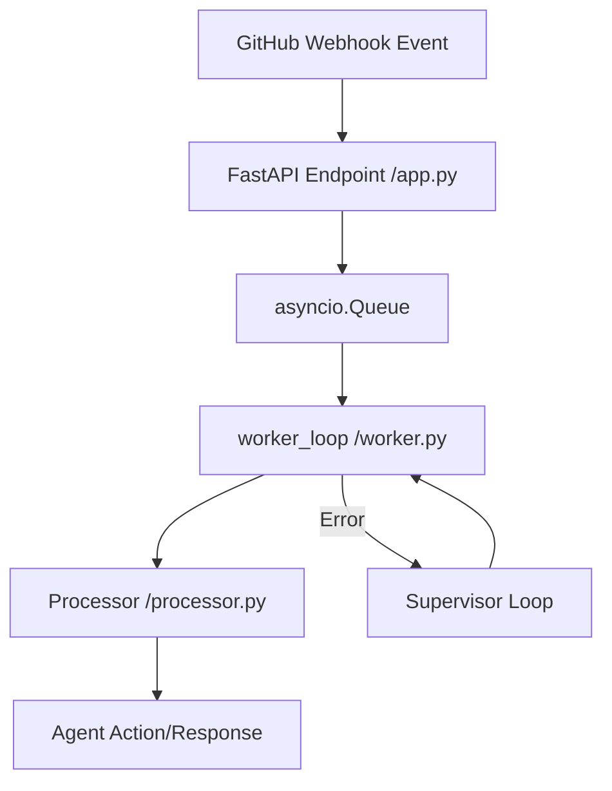

# Implementation Plan: Unified Async Architecture for Webhook Agent (PR #18)

**Project Identifier:** Unified Async Architecture for Webhook Agent (PR #18)

## Context & Purpose
**Core Objective:**
Refactor the webhook agent to resolve issues identified in PR #18, specifically by unifying the asynchronous architecture. The goal is to replace the complex Pub/Sub and multiprocessing setup with a streamlined in-memory `asyncio.Queue` system, reducing overhead and improving reliability.

**Technical Approach:**
Transitioning from a polling/distributed model using Pub/Sub and `multiprocessing` to an event-driven in-process model. We will utilize FastAPI's `lifespan` events to manage a background `worker_loop` that consumes messages from a global `asyncio.Queue`.

**Impact Assessment:**
- [ ] **Low:** Isolated changes; minimal regression risk.
- [ ] **Moderate:** Affects related services; requires coordinated testing.
- [x] **Critical:** Core architecture/API contract change; high regression risk.

**Out of Scope:**
- Changes to the core Gemini API prompt logic.
- Modifications to other agents within the Hannibal Hub.
- Database schema migrations (if any).

**Error Handling & Edge Cases:**
- **Worker Crashes:** Implement a Supervisor Pattern within the `lifespan` handler to log failures and automatically restart the `worker_loop` if it terminates unexpectedly.
- **Queue Overflow:** While not explicitly detailed, the use of `asyncio.Queue` provides a foundation for implementing backpressure if needed.

---

## Component Breakdown
**Affected Components:**

- **FastAPI Application (`src/webhook_agent/app.py`)**: Replace `publish_webhook_message` (Pub/Sub) with pushes to a global `asyncio.Queue`. Implement the `lifespan` handler to manage the worker's lifecycle.
- **Webhook Worker (`src/webhook_agent/worker.py`)**: Refactor the worker into an `async def worker_loop()` that asynchronously consumes tasks from the queue.
- **Entry Point (`main.py`)**: Remove `multiprocessing` logic and simplify the file to only launch the FastAPI server.
- **Message Processor (`src/webhook_agent/processor.py`)**: Replace hardcoded `BOT_LOGIN` with a dynamic lookup using `os.environ.get('BOT_LOGIN', 'hannibal-hub-agents[bot]')`.
- **Cleanup (`src/webhook_agent/enqueue.py`)**: This file will be deleted as the unified in-memory architecture removes the need for separate enqueueing logic.

---

## Workflow Visualization
The following diagram illustrates the refactored async flow from webhook reception to processing.

---

## Implementation Phases
**Deployment Roadmap:**

### Phase 1: Async Core Refactor
- [ ] **Queue Integration**: Implement the global `asyncio.Queue` in `app.py` and replace Pub/Sub calls.
- [ ] **Worker Async Conversion**: Refactor `worker.py` to use `async def worker_loop()`.
- [ ] **Lifespan Management**: Add the `lifespan` event in `app.py` to start the worker via `asyncio.create_task`.
- [ ] **Main Simplification**: Remove `multiprocessing` from `main.py`.
- **Verification**: Ensure the server starts without errors and the worker task is initialized.

### Phase 2: Reliability & Identity
- [ ] **Supervisor Pattern**: Wrap the `worker_loop` in a restart loop within the lifespan handler.
- [ ] **Dynamic Identity**: Update `processor.py` to use environment variables for `BOT_LOGIN`.
- [ ] **Env Standardization**: Ensure all `os.environ` access in `app.py` uses `.get()`.
- **Verification**: Kill the worker task manually (if possible) or simulate a crash to verify the supervisor restarts it.

### Phase 3: Cleanup & Final Polish
- [ ] **File Removal**: Delete `src/webhook_agent/enqueue.py`.
- [ ] **Linting**: Run `scripts/ruff-all.sh` and fix all violations.
- **Verification**: Zero linting errors and verified project structure.

---

## Expected Output Schema & Verification
**Verification Plan:**

1. **Integration Test (End-to-End)**: Deliver a mock GitHub webhook payload to the FastAPI endpoint and verify that the `worker_loop` processes the message and triggers the processor.
2. **System Stability Test**: Verify that the FastAPI server starts and stops cleanly via the `lifespan` handler.
3. **Lint/Format**: Run `scripts/ruff-all.sh` and ensure zero errors.

---

*Kept perfectly up to date with 💖 and lots of ☕*  
**Last Updated:** 2026-07-02 21:50 EDT

